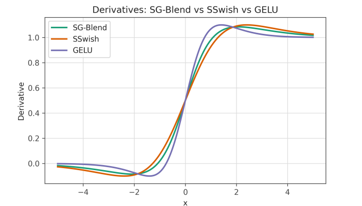

# SG-Blend: Learning an Interpolation Between Improved Swish and GELU for Robust Neural Representations



[](https://neurips.cc/)
[](https://opensource.org/licenses/Apache-2.0)

This repository contains the official implementation for the NeurIPS 2025 paper:

**SG-Blend: Learning an Interpolation Between Improved Swish and GELU for Robust Neural Representations**

[Gaurav Sarkar](https://www.linkedin.com/in/gauravsarkar7888/), [Jay Gala](https://www.linkedin.com/in/jaykishorgala/), [Subarna Tripathi](https://www.linkedin.com/in/subarnatripathi/)

[Project Page]() | [arXiv]() | [Paper]() | [Video]()

## Abstract
> The design of activation functions remains a pivotal component in optimizing deep neural networks, with prevailing choices like Swish and GELU demonstrating considerable efficacy yet often exhibiting domain-specific optima. This work introduces SG-Blend, a novel activation function that blends our proposed SSwish, a First-Order Symmetric variant of Swish, and the established GELU through dynamic interpolation. By adaptively blending these constituent functions through learnable parameters, SG-Blend aims to harness their complementary strengths: SSwish's controlled non-monotonicity and symmetry, and GELU's smooth, probabilistic profile, to achieve a more universally robust balance between model expressivity and gradient stability. We conduct comprehensive empirical evaluations across diverse modalities and architectures and show performance improvements across all considered natural language and computer vision tasks and models. These results, achieved with negligible computational overhead, underscore SG-Blend's potential as a versatile, drop-in replacement that consistently outperforms strong contemporary baselines.

## Key Features

- **SG-Blend Activation**: Novel adaptive activation function that dynamically interpolates between SSwish (our symmetric Swish variant) and GELU
- **Universal Performance**: Outperforms baseline activations across diverse NLP and CV tasks
- **Minimal Overhead**: Adds negligible computational cost while improving model expressivity
- **Plug-and-Play**: Drop-in replacement for existing activation functions in any TensorFlow/Keras model
- **Comprehensive Evaluation**: Benchmarks against 12 contemporary activation functions on WMT14 translation

## Installation

```bash
git clone https://github.com/yourusername/sg-blend.git
cd sg-blend

# Create and activate virtual environment
python -m venv sg_env
source sg_env/bin/activate  # Linux/Mac
# sg_env\Scripts\activate  # Windows

# Install dependencies
pip install -r requirements.txt

# Download NLTK data for evaluation
python -c "import nltk; nltk.download('punkt')"
```

## Usage

### Using SG-Blend in Your Model

```python
from activations.layers import SGBlend

model = tf.keras.Sequential([
    tf.keras.layers.Dense(128),
    SGBlend(),  # Our proposed activation
    tf.keras.layers.Dense(10, activation='softmax')
])
```

### Reproducing WMT14 Translation Experiment

```bash
python run_experiment.py \
  --max_samples 50000 \
  --epochs 10 \
  --batch_size 64 \
  --d_model 128 \
  --ff_dim 256
```

### Command Line Options
| Parameter | Default | Description |
|-----------|---------|-------------|
| `--max_samples` | 50000 | Training samples to use |
| `--epochs` | 10 | Training epochs |
| `--batch_size` | 64 | Batch size |
| `--d_model` | 64 | Transformer embedding dimension |
| `--ff_dim` | 128 | Feed-forward dimension |
| `--num_heads` | 2 | Attention heads |
| `--num_layers` | 2 | Transformer layers |

## Results

### WMT14 English-German Translation Performance
| Activation | Val Accuracy | BLEU | Dead Neurons (%) | Time/Epoch (s) |
|------------|--------------|------|------------------|----------------|
| **SG-Blend** | **0.782** | **0.341** | 1.2% | 142 |
| GELU | 0.769 | 0.328 | 2.8% | 138 |
| Swish | 0.773 | 0.332 | 1.8% | 140 |
| SSwish | 0.778 | 0.337 | 1.5% | 141 |
| ReLU | 0.758 | 0.312 | 8.4% | 136 |

### Performance Comparison


## License

This project is licensed under the Apache License 2.0 - see the [LICENSE](LICENSE) file for details.

## Contact

For questions or issues, please open an issue or contact [author@institution.edu].
